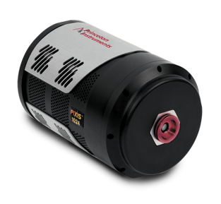

.. _camera-princeton:

MyCamera
--------



Introduction
````````````

Princeton's camera are often use for Spectroscopy.

This Lima module has been tested with:

    - Pixis 100 and 400.

This module was tested with **PiCam 5.x**. You can get it
.. _Latest: ftp://ftp.piacton.com/Public/Software/Official/PICam/PICam%20Install.exe

Documentation can be found
.. _Doc: https://www.princetoninstruments.com/products/software-family/pi-cam

Installation & Module configuration
````````````````````````````````````

First, you need to install the SDK.

Then, follow the generic instructions in :ref:`build_installation`. If using CMake directly, add the following flag:

.. code-block:: sh

  -DLIMACAMERA_PRINCETON=true

For the Tango server installation, refers to :ref:`tango_installation`.

Initialisation and Capabilities
```````````````````````````````

Implementing a new plugin for new detector is driven by the LIMA framework but the developer has some freedoms to choose which standard and specific features will be made available. This section is supposed to give you the correct information regarding how the camera is exported within the LIMA framework.

Interface initialisation
........................

.. cpp:namespace-push:: lima::princeton

The interface will be initialized within the :cpp:class:`Interface` object.
The :cpp:func:`Interface` constructor takes an optional serial parameter.

If serial parameter is left empty, the plugin will open the first camera founded.


Small example showing possible ways to initialize:

.. code-block:: python

  from Lima import Princeton
  from lima import Core

  interface = Princeton.Interface()
  
.. cpp:namespace-pop

Standard capabilities
.....................

This plugin has been implemented in respect of the mandatory
capabilites but with some limitations which are due to the camera and
SDK features. Only restriction on capabilities are documented here.

* HwDetInfo

  Only support Bpp16 Images.

* HwSync

  No restriction, plugin should offer all trigger mode available for the camera.

Optional capabilites
....................

None

How to use
``````````
This is a python code example for a simple test:

.. code-block:: python

  from Lima import Princeton
  from lima import Core

  hwint = Princeton.Interface("")
  ct = Core.CtControl(hwint)

  acq = ct.acquisition()

  # set and test an acquisition
  #

  # setting new file parameters and autosaving mode
  saving=ct.saving()

  pars=saving.getParameters()
  pars.directory='/buffer/lcb18012/opisg/test_lima'
  pars.prefix='test1_'
  pars.suffix='.edf'
  pars.fileFormat=Core.CtSaving.TIFF
  pars.savingMode=Core.CtSaving.AutoFrame
  saving.setParameters(pars)

  # now ask for 2 sec. exposure and 10 frames
  acq.setAcqExpoTime(2)
  acq.setNbImages(10)

  ct.prepareAcq()
  ct.startAcq()

  # wait for last image (#9) ready
  lastimg = ct.getStatus().ImageCounters.LastImageReady
  while lastimg !=9:
    time.sleep(1)
    lastimg = ct.getStatus().ImageCounters.LastImageReady

  # read the first image
  im0 = ct.ReadImage(0)
